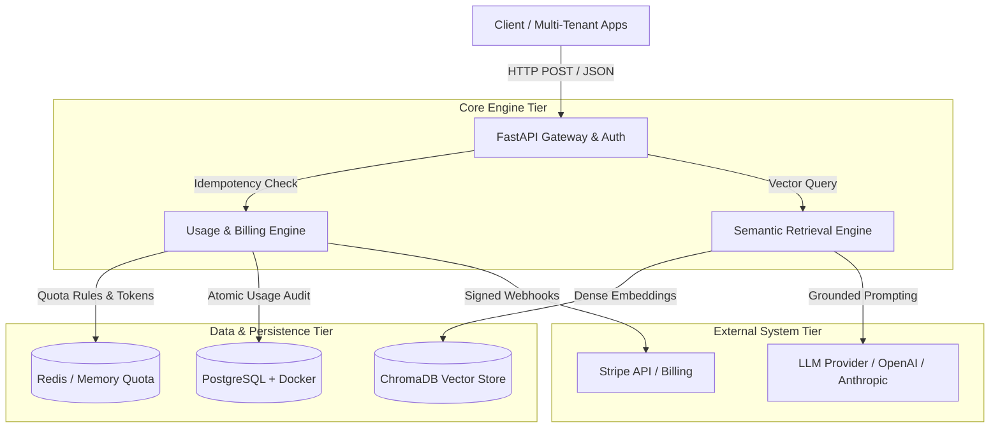

<div align="center">


<br/>

[](https://git.io/typing-svg)

<br/>

<a href="https://www.linkedin.com/in/sairajnarayankar" target="_blank">
  
</a>
<a href="https://github.com/SairajNarayankar" target="_blank">
  
</a>


<br/><br/>

</div>

---

## ⚡ System Manifest

```python
from typing import List, Dict, Any
from pydantic import BaseModel, Field

class BackendAIEngineer(BaseModel):
    name: str = "Sairaj Narayankar"
    current_role: str = "Backend AI Engineering Intern @ Flyrank AI"
    location: str = "Mumbai, India [19.0760° N, 72.8777° E]"
    education: str = "B.Sc. Information Technology — University of Mumbai"
    
    primary_runtime: Dict[str, Any] = {
        "paradigm": "Async / Event-Driven / Fault-Tolerant",
        "focus": ["LLM Infrastructure", "Usage Metering Engines", "RAG Pipelines", "Agent Orchestration"],
        "code_guarantees": ["Idempotency", "Atomic Transactions", "Zero Floating-Point Money Drift"]
    }
    
    active_stack: List[str] = [
        "FastAPI", "Python 3.11+", "Async PostgreSQL", "SQLAlchemy",
        "ChromaDB", "Docker Compose", "LangChain/LangGraph", "Stripe CLI"
    ]
    
    async def process_task(self, query: str) -> str:
        """Ingests requirements, optimizes token efficiency, and ships resilient APIs."""
        return f"Executing {query} with p99 low-latency and deterministic fallbacks."
```

---

## 🏗️ Architectural Topology

Here is how I design production backend systems for AI-driven workloads:



---

## ⚙️ Core System Components

<table>
<tr>
<td width="50%">

### 🤖 LLM & Vector Compute
- **RAG Architecture** — Hybrid dense retrieval (ChromaDB) with TF-IDF/lexical failovers & semantic reranking.
- **Agent Orchestration** — Tool-calling loops, stateful graphs, and Model Context Protocol (MCP) integrations.
- **Metering & Quota Enforcers** — Real-time token tracking, input/output/reasoning pricing, and rate limiting.

</td>
<td width="50%">

### 🛡️ Resilient Backend Engineering
- **Async API Design** — High-concurrency FastAPI services with Pydantic validation & OpenAPI specs.
- **Persistence & Migration** — PostgreSQL with async SQLAlchemy ORM and Alembic schema versioning.
- **Payment & Webhook Security** — Stripe Checkout flows, raw-body HMAC signature validation, and replay protection.

</td>
</tr>
</table>

---

## 🛠️ Stack Telemetry

### 01. Artificial Intelligence & Vector Engines


### 02. Async API Tier & Microservices


### 03. Storage, Containers & Infrastructure


---

## 📦 Featured Production Systems

<table>
<tr>
<td width="50%">

### ⚡ LLM Usage Metering & Billing Engine
**FlyRank AI Internship Capstone — Backend Track**

Production-grade metering middleware and subscription billing service for SaaS AI platforms.

```yaml
guarantees:
  idempotency: Exactly-once usage event recording via unique keys
  pricing_model: Independent token tiers (Cached input / Output / Reasoning)
  quota_protection: HTTP 429 (Limit Exceeded) & HTTP 402 (Payment Required)
  currency_precision: Integer-cent integer math (Zero floating-point drift)
  security: Stripe HMAC signature verification & webhook replay defense
```

**Stack:** `FastAPI` `PostgreSQL` `SQLAlchemy` `Alembic` `Stripe CLI` `Docker` `pytest`

[](https://github.com/SairajNarayankar/LLM-Usage-Metering-billing-Service)

</td>
<td width="50%">

### 🔍 Cricket AI Predictive Engine & Hybrid RAG
**End-to-End Predictive & Semantic Retrieval System**

Complete pipeline integrating automated match scraping, ML inference, and dual-engine RAG search.

```yaml
metrics:
  classifier: Random Forest (Match outcome prediction)
  accuracy: 80.00%
  f1_score: 0.8571
guarantees:
  data_integrity: Strict chronological feature engineering (Zero data leakage)
  retrieval_failover: ChromaDB dense vector search with TF-IDF fallback
```

**Stack:** `Python` `scikit-learn` `ChromaDB` `SentenceTransformers` `BeautifulSoup` `pandas`

</td>
</tr>
</table>

---

## 🎓 Verified Credentials

<div align="center">

| System Certification | Issuing Organization | Year |
|----------------------|----------------------|------|
| 🏅 **Generative AI Engineering Professional Certificate** | IBM | 2026 |
| ☁️ **Microsoft Azure Fundamentals (AZ-900)** | Microsoft | 2025 |
| 🌏 **Google Cloud Gen AI Academy — APAC Cohort 1** | Google Cloud | 2026 |

</div>

---

## 📊 System Metrics & Activity

<div align="center">


<br/>


</div>

---

## 🔄 Active Worker Threads

```syslog
[RUNNING]  Implementing Model Context Protocol (MCP) server & tool integrations
[RUNNING]  Evaluating LangGraph multi-agent orchestration and loop persistence
[QUEUED]   Building automated LLM observability & token tracing pipelines
[QUEUED]   Refining case-study engineering write-ups for production AI systems
```

---

## 🤝 Let's Connect

<div align="center">

Interested in **AI Infrastructure, RAG Systems, Multi-Agent Architectures**, or **High-Concurrency Backends**? Let's connect and build something resilient.

<br/>

[](https://www.linkedin.com/in/sairajnarayankar)
[](https://github.com/SairajNarayankar)

<br/>


</div>
